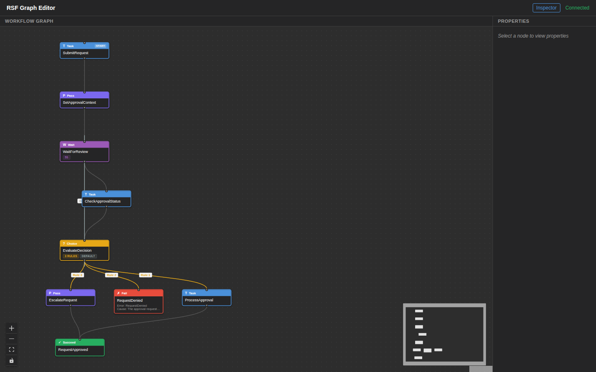
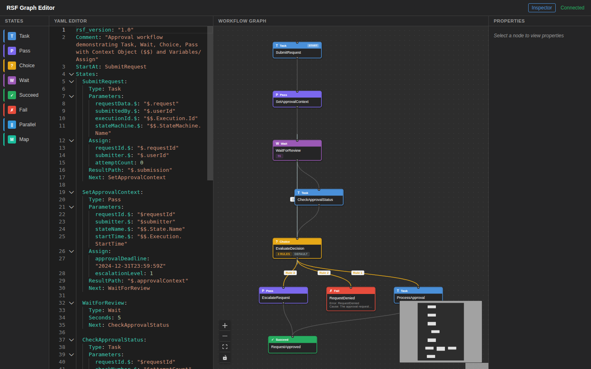
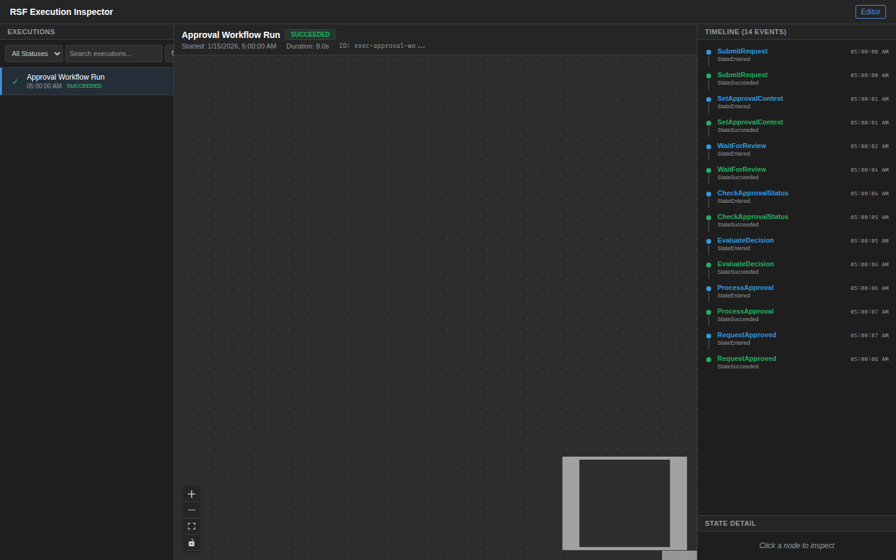

# Approval Workflow

A multi-step approval process demonstrating Context Object (`$$`) references, Variables/Assign, Wait state, and looping patterns.

## DSL Features Demonstrated

| Feature | Usage |
|---------|-------|
| **Task** | SubmitRequest, CheckApprovalStatus, ProcessApproval |
| **Pass** | SetApprovalContext (data transformation), EscalateRequest |
| **Wait** | WaitForReview (5-second polling interval) |
| **Choice** | EvaluateDecision routes by approval status and attempt count |
| **Succeed** | RequestApproved terminal state |
| **Fail** | RequestDenied terminal state |
| **Context Object (`$$`)** | `$$.Execution.Id`, `$$.StateMachine.Name`, `$$.State.Name`, `$$.Execution.StartTime` |
| **Variables/Assign** | `requestId`, `submitter`, `attemptCount`, `escalationLevel`, `approvalDeadline` |
| **Intrinsic Functions** | `States.MathAdd()` for incrementing attempt and escalation counters |
| **Parameters** | Dynamic parameter construction with path references |
| **Output** | Explicit output field definition on ProcessApproval and EscalateRequest |
| **ResultPath** | Per-state result scoping (`$.submission`, `$.approvalContext`, etc.) |

## Workflow Path

```
SubmitRequest → SetApprovalContext (Pass)
  → WaitForReview (Wait 5s)
  → CheckApprovalStatus → EvaluateDecision
      ├─ "approved" → ProcessApproval → RequestApproved
      ├─ "denied" → RequestDenied (Fail)
      ├─ attemptCount > 3 → EscalateRequest → RequestApproved
      └─ default → WaitForReview (loop)
```

## Screenshots

### Graph Editor



### DSL Editor



### Execution Inspector



## Run Locally (No AWS)

```bash
pytest examples/approval-workflow/tests/test_local.py -v
```

## Run Integration Test (AWS)

```bash
pytest tests/test_examples/test_approval_workflow.py -m integration -v
```
