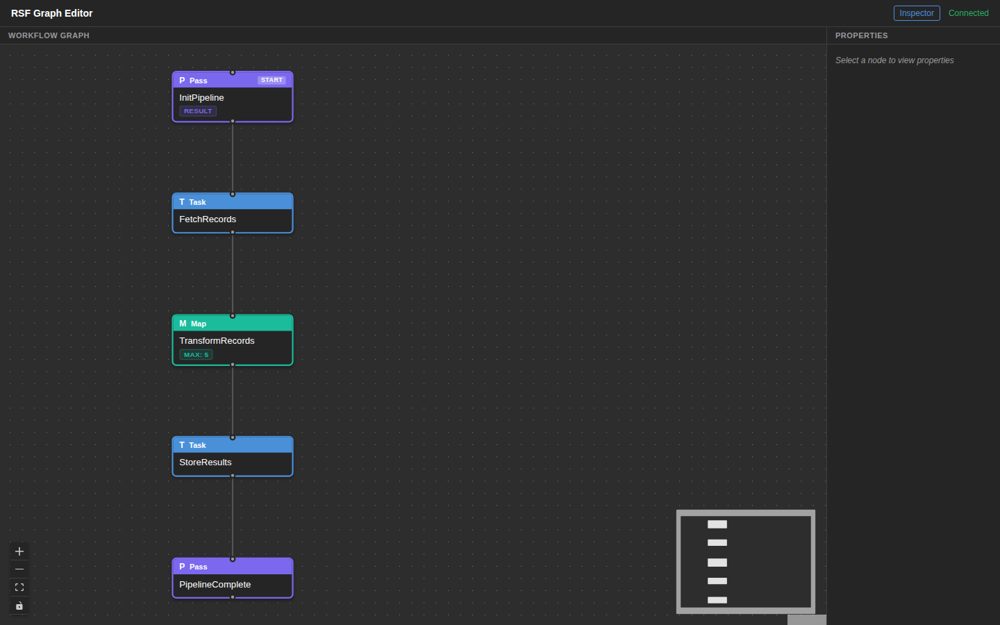
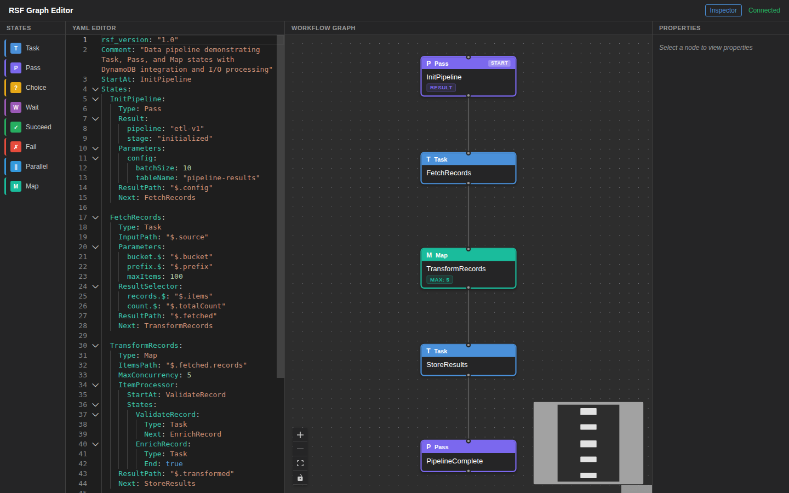
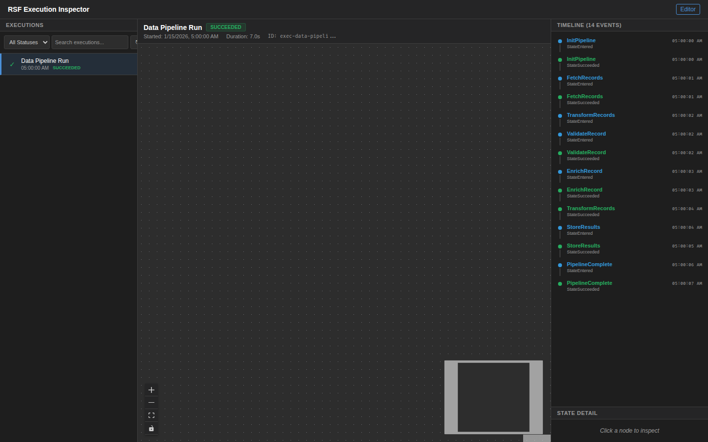

# Data Pipeline

An ETL pipeline demonstrating Map state for batch processing, full I/O pipeline stages, and DynamoDB integration.

## DSL Features Demonstrated

| Feature | Usage |
|---------|-------|
| **Task** | FetchRecords, ValidateRecord, EnrichRecord, StoreResults |
| **Pass** | InitPipeline (config construction), PipelineComplete |
| **Map** | TransformRecords with MaxConcurrency=5 and nested ItemProcessor |
| **ItemsPath** | `$.fetched.records` — iterate over fetched record array |
| **ItemProcessor** | Nested state machine: ValidateRecord → EnrichRecord |
| **InputPath** | `$.source` on FetchRecords, `$` on ArrayOperations/StoreResults |
| **OutputPath** | `$.stored` on StoreResults |
| **Parameters** | Dynamic parameter construction on FetchRecords and StoreResults |
| **ResultSelector** | `$.items` → `records`, `$.totalCount` → `count` on FetchRecords |
| **ResultPath** | Per-state result scoping (`$.config`, `$.fetched`, `$.transformed`, `$.stored`) |
| **DynamoDB** | StoreResults performs batch writes to a DynamoDB table |

## Workflow Path

```
InitPipeline (Pass) → FetchRecords
  → TransformRecords (Map, max 5 concurrent)
      └─ per item: ValidateRecord → EnrichRecord
  → StoreResults (DynamoDB batch write)
  → PipelineComplete (Pass)
```

## Screenshots

### Graph Editor



### DSL Editor



### Execution Inspector



## Run Locally (No AWS)

```bash
pytest examples/data-pipeline/tests/test_local.py -v
```

## Run Integration Test (AWS)

```bash
pytest tests/test_examples/test_data_pipeline.py -m integration -v
```
