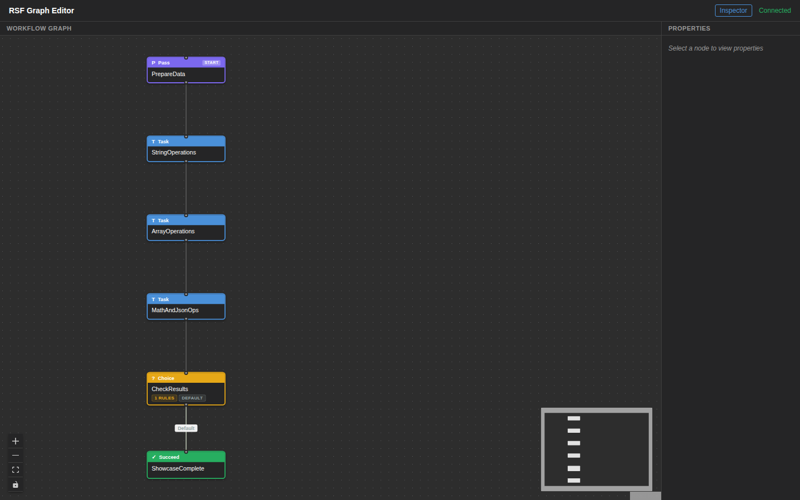
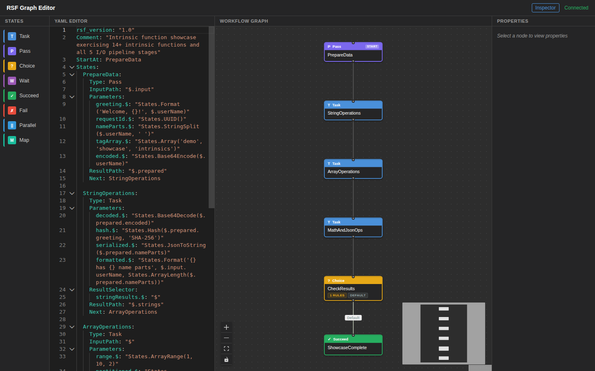
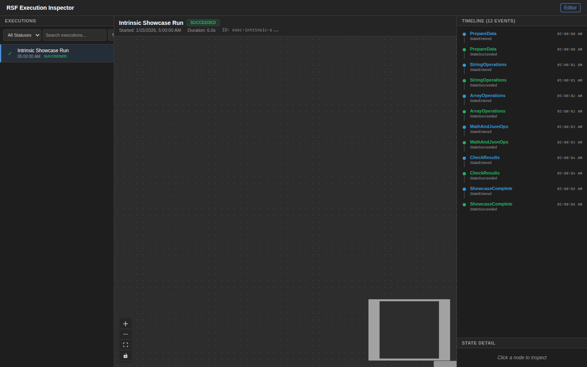

# Intrinsic Showcase

A comprehensive showcase of all RSF intrinsic functions and the full 5-stage I/O pipeline (InputPath, Parameters, ResultSelector, ResultPath, OutputPath).

## DSL Features Demonstrated

| Feature | Usage |
|---------|-------|
| **Task** | StringOperations, ArrayOperations, MathAndJsonOps |
| **Pass** | PrepareData (intrinsic function evaluation) |
| **Choice** | CheckResults (BooleanEquals condition) |
| **Succeed** | ShowcaseComplete terminal state |
| **InputPath** | `$.input` on PrepareData, `$` on ArrayOperations |
| **Parameters** | Dynamic parameter construction with intrinsic function calls |
| **ResultSelector** | `stringResults`, `arrayResults` wrapping on Task states |
| **ResultPath** | Per-state result scoping (`$.prepared`, `$.strings`, `$.arrays`, `$.math`) |
| **OutputPath** | `$` on MathAndJsonOps |

### Intrinsic Functions (14+)

| Category | Functions |
|----------|-----------|
| **String** | `States.Format()`, `States.StringSplit()`, `States.Base64Encode()`, `States.Base64Decode()`, `States.Hash()` (SHA-256), `States.JsonToString()`, `States.StringToJson()` |
| **Array** | `States.Array()`, `States.ArrayLength()`, `States.ArrayRange()`, `States.ArrayPartition()`, `States.ArrayContains()`, `States.ArrayGetItem()`, `States.ArrayUnique()` |
| **Math** | `States.MathAdd()`, `States.MathRandom()` |
| **Utility** | `States.UUID()` |

## Workflow Path

```
PrepareData (Pass — Format, UUID, StringSplit, Array, Base64Encode)
  → StringOperations (Base64Decode, Hash, JsonToString, Format+ArrayLength)
  → ArrayOperations (ArrayRange, ArrayPartition, ArrayContains, ArrayGetItem, ArrayUnique)
  → MathAndJsonOps (MathAdd, MathRandom, StringToJson)
  → CheckResults (Choice)
  → ShowcaseComplete
```

## Screenshots

### Graph Editor



### DSL Editor



### Execution Inspector



## Run Locally (No AWS)

```bash
pytest examples/intrinsic-showcase/tests/test_local.py -v
```

## Run Integration Test (AWS)

```bash
pytest tests/test_examples/test_intrinsic_showcase.py -m integration -v
```
