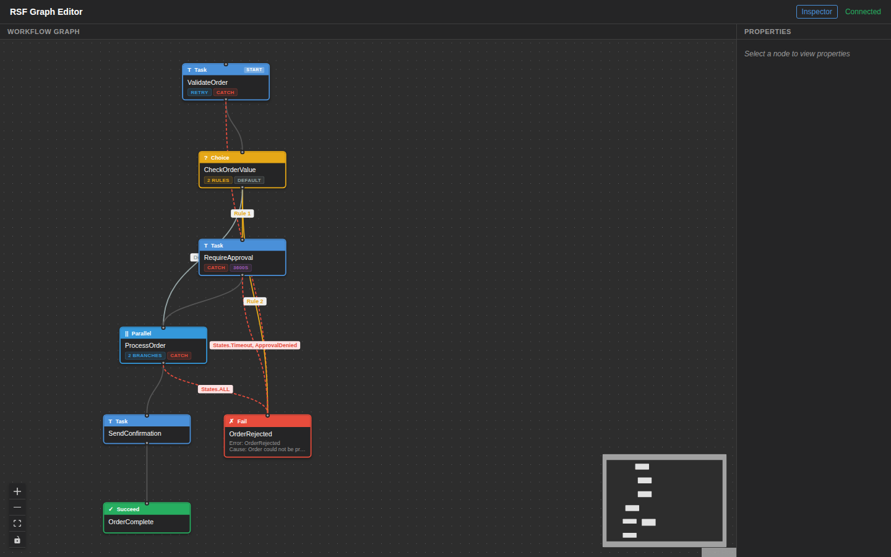
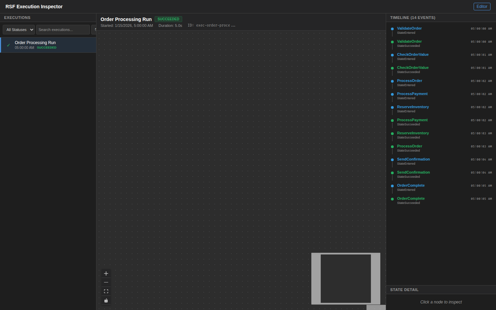

# Order Processing

An order validation and fulfillment workflow demonstrating core RSF state types with error handling and parallel execution.

## DSL Features Demonstrated

| Feature | Usage |
|---------|-------|
| **Task** | ValidateOrder, RequireApproval, ProcessPayment, ReserveInventory, SendConfirmation |
| **Choice** | Route by order value (>$1000 requires approval) and item count (0 items rejected) |
| **Parallel** | ProcessPayment and ReserveInventory execute concurrently |
| **Succeed** | OrderComplete terminal state |
| **Fail** | OrderRejected terminal state with error/cause |
| **Retry** | ValidationTimeout (backoff 2.0), PaymentGatewayError, InventoryLockError |
| **Catch** | InvalidOrderError, States.Timeout, ApprovalDenied, States.ALL |
| **TimeoutSeconds** | 3600s timeout on RequireApproval |
| **ResultPath** | Per-state result scoping (`$.validation`, `$.processing`, etc.) |

## Workflow Path

```
ValidateOrder → CheckOrderValue
  ├─ total > 1000 → RequireApproval → ProcessOrder
  ├─ itemCount == 0 → OrderRejected (Fail)
  └─ default → ProcessOrder
       ├─ ProcessPayment ─┐
       └─ ReserveInventory┘→ SendConfirmation → OrderComplete
```

## Screenshots

### Graph Editor



### DSL Editor


### Execution Inspector



## Run Locally (No AWS)

```bash
pytest examples/order-processing/tests/test_local.py -v
```

## Run Integration Test (AWS)

```bash
pytest tests/test_examples/test_order_processing.py -m integration -v
```
