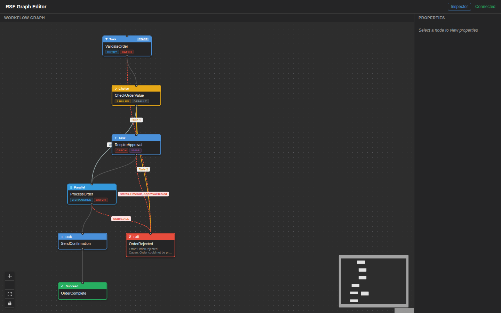
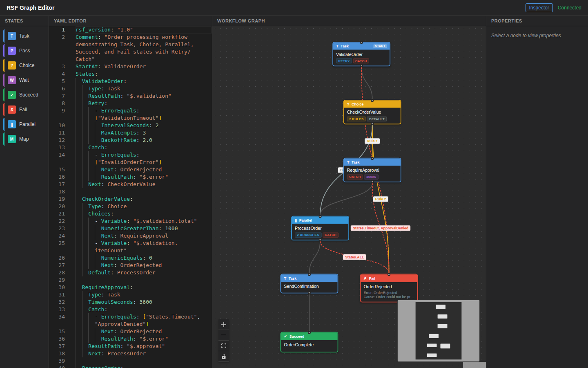
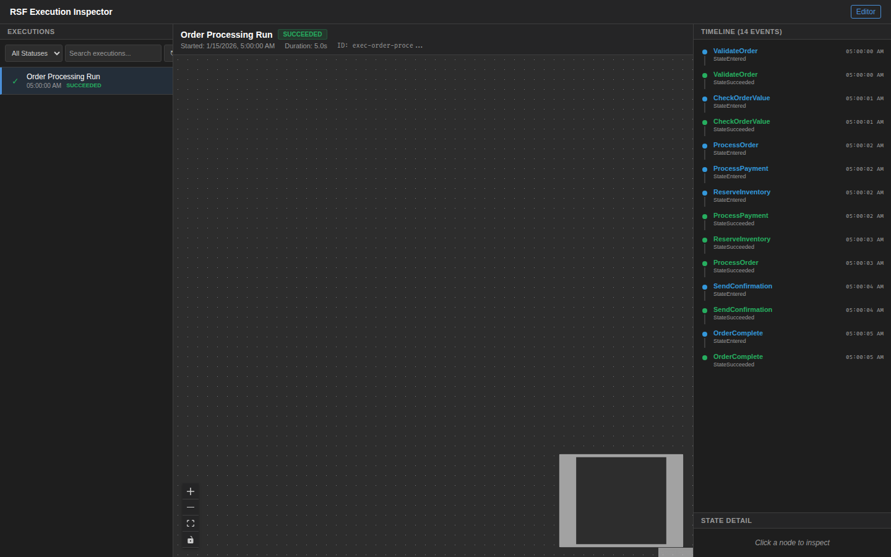

# Order Processing

An order validation and fulfillment workflow demonstrating core RSF state types with error handling and parallel execution.

## DSL Features Demonstrated

| Feature | Usage |
|---------|-------|
| **Task** | ValidateOrder, RequireApproval, ProcessPayment, ReserveInventory, SendConfirmation |
| **Choice** | Route by order value (>$1000 requires approval) and item count (0 items rejected) |
| **Parallel** | ProcessPayment and ReserveInventory execute concurrently |
| **Succeed** | OrderComplete terminal state |
| **Fail** | OrderRejected terminal state with error/cause |
| **Retry** | ValidationTimeout (backoff 2.0), PaymentGatewayError, InventoryLockError |
| **Catch** | InvalidOrderError, States.Timeout, ApprovalDenied, States.ALL |
| **TimeoutSeconds** | 3600s timeout on RequireApproval |
| **ResultPath** | Per-state result scoping (`$.validation`, `$.processing`, etc.) |

## Workflow Path

```
ValidateOrder → CheckOrderValue
  ├─ total > 1000 → RequireApproval → ProcessOrder
  ├─ itemCount == 0 → OrderRejected (Fail)
  └─ default → ProcessOrder
       ├─ ProcessPayment ─┐
       └─ ReserveInventory┘→ SendConfirmation → OrderComplete
```

## Screenshots

### Graph Editor



### DSL Editor



### Execution Inspector



## Run Locally (No AWS)

```bash
pytest examples/order-processing/tests/test_local.py -v
```

## Run Integration Test (AWS)

```bash
pytest tests/test_examples/test_order_processing.py -m integration -v
```

## Observability

This example demonstrates three observability features available for RSF workflows.

### OpenTelemetry Tracing

The generated orchestrator includes optional OpenTelemetry tracing with parent and child spans. Install the tracing dependency to enable it:

```bash
pip install rsf[tracing]
```

When enabled, the orchestrator creates:
- A parent span (`workflow.execute`) covering the entire workflow execution
- Child spans for each state transition, named after the state

Spans include attributes like `workflow.name`, `workflow.start_at`, and `state.name`.

### CloudWatch Custom Metrics

The orchestrator emits three CloudWatch custom metrics under the `RSF/Workflows` namespace:

| Metric | Unit | When Emitted |
|--------|------|-------------|
| `WorkflowExecutions` | Count | At workflow start (1 per invocation) |
| `WorkflowDuration` | Milliseconds | At workflow completion |
| `WorkflowErrors` | Count | When an unhandled exception propagates |

All metrics are dimensioned by `WorkflowName` (value: `order-processing`). Metric emission is fire-and-forget -- errors in `_emit_metric` are swallowed so they never break workflow execution.

To add metrics to your own workflows, copy the metrics code pattern from `src/generated/orchestrator.py`:

```python
import time as _metrics_time

try:
    import boto3 as _metrics_boto3
    _cw_client = _metrics_boto3.client("cloudwatch")
    _CW_METRICS_AVAILABLE = True
except Exception:
    _CW_METRICS_AVAILABLE = False

WORKFLOW_NAME = "my-workflow"
CW_NAMESPACE = "RSF/Workflows"

def _emit_metric(name: str, value: float, unit: str) -> None:
    if not _CW_METRICS_AVAILABLE:
        return
    try:
        _cw_client.put_metric_data(
            Namespace=CW_NAMESPACE,
            MetricData=[{
                "MetricName": name,
                "Value": value,
                "Unit": unit,
                "Dimensions": [
                    {"Name": "WorkflowName", "Value": WORKFLOW_NAME},
                ],
            }],
        )
    except Exception:
        pass
```

### Grafana Dashboard

A ready-to-import Grafana dashboard is provided at `dashboards/grafana.json`. It includes four panels:

1. **Workflow Executions** -- timeseries showing execution count over time
2. **Duration Percentiles** -- p50, p95, p99 latency timeseries
3. **Error Rate %** -- stat panel with color-coded thresholds
4. **Recent Errors** -- table of recent error log entries from CloudWatch Logs

To import: In Grafana, go to Dashboards > Import > Upload JSON file, then select `dashboards/grafana.json`. Configure the CloudWatch datasource and adjust the `workflow_name` template variable as needed.

### Cost Estimation

Use `rsf cost` to estimate monthly AWS costs for this workflow:

```bash
rsf cost examples/order-processing/workflow.yaml --invocations 10000

# Example output:
# Workflow: order-processing
# Region: us-east-1
# Monthly invocations: 10,000
# Tasks per execution: 5
#
# Service              Monthly Cost    Detail
# Lambda               $0.03           50,000 invocations @ 128MB
# Data Transfer         $0.00           Within free tier
# Total                $0.03/month
```

Use `--json` for machine-readable output or `--region` to compare pricing across regions.
