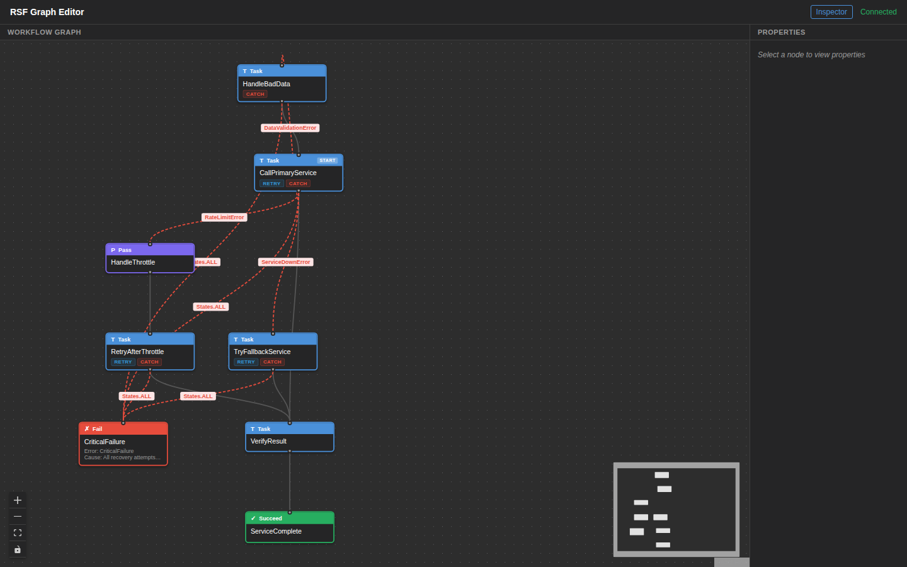
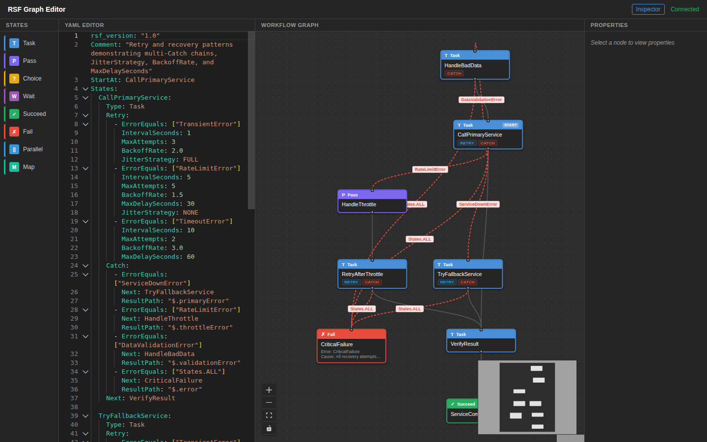
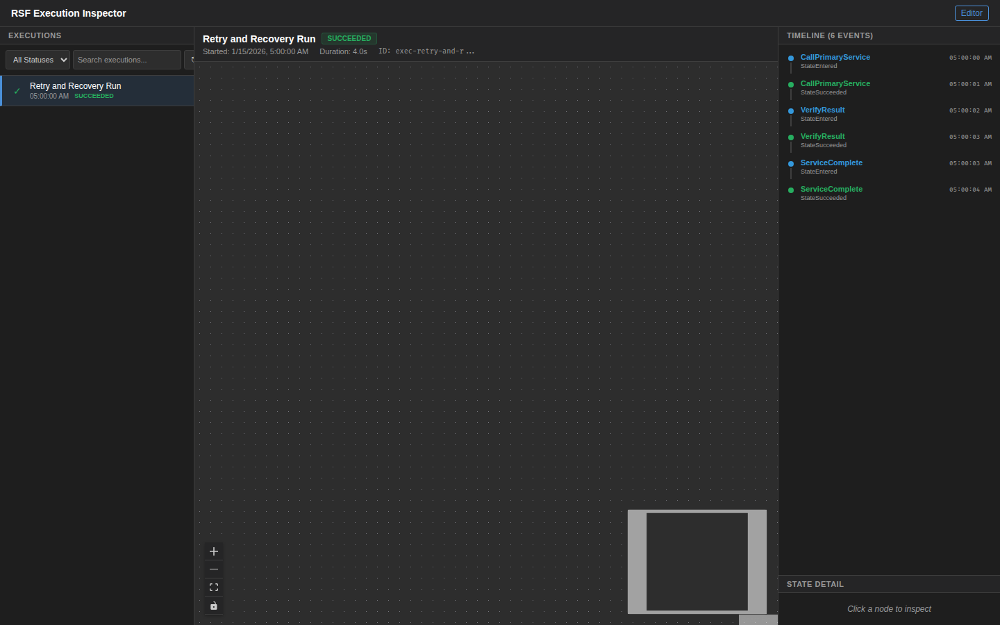

# Retry and Recovery

Advanced error handling patterns demonstrating multiple retry policies with JitterStrategy, MaxDelaySeconds, multi-Catch chains, and fallback service routing.

## DSL Features Demonstrated

| Feature | Usage |
|---------|-------|
| **Task** | CallPrimaryService, TryFallbackService, RetryAfterThrottle, HandleBadData, VerifyResult |
| **Pass** | HandleThrottle (error context packaging) |
| **Succeed** | ServiceComplete terminal state |
| **Fail** | CriticalFailure terminal state |
| **Multi-Retry** | 3 retry policies on CallPrimaryService, each with different error types and strategies |
| **JitterStrategy** | FULL (TransientError) and NONE (RateLimitError) |
| **BackoffRate** | 1.5x, 2.0x, 3.0x across different policies |
| **MaxDelaySeconds** | 30s (rate limit), 60s (timeout), 120s (throttle recovery) |
| **Multi-Catch** | Up to 4 catch handlers per state: ServiceDownError, RateLimitError, DataValidationError, States.ALL |
| **Catch-to-Recovery** | HandleBadData loops back to CallPrimaryService after data sanitization |
| **ResultPath** | Error routing via `$.primaryError`, `$.throttleError`, `$.validationError` |

### Retry Policy Summary

| Error Type | Interval | MaxAttempts | Backoff | MaxDelay | Jitter |
|-----------|----------|-------------|---------|----------|--------|
| TransientError | 1s | 3 | 2.0x | — | FULL |
| RateLimitError | 5s | 5 | 1.5x | 30s | NONE |
| TimeoutError | 10s | 2 | 3.0x | 60s | — |

## Workflow Path

```
CallPrimaryService
  ├─ success → VerifyResult → ServiceComplete
  ├─ ServiceDownError → TryFallbackService → VerifyResult
  ├─ RateLimitError → HandleThrottle (Pass) → RetryAfterThrottle → VerifyResult
  ├─ DataValidationError → HandleBadData → CallPrimaryService (retry loop)
  └─ States.ALL → CriticalFailure (Fail)
```

## Screenshots

### Graph Editor



### DSL Editor



### Execution Inspector



## Run Locally (No AWS)

```bash
pytest examples/retry-and-recovery/tests/test_local.py -v
```

## Run Integration Test (AWS)

```bash
pytest tests/test_examples/test_retry_recovery.py -m integration -v
```
